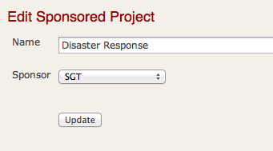

# Whiteboard for CMU-SV

Welcome to the CMU-SV rails project for the Education group.

## Documentation

* [Course](http://rubydoc.info/github/professor/whiteboard/Course)
* [Deliverable](http://rubydoc.info/github/professor/whiteboard/Deliverable)
* [Peer Evaluation](http://rubydoc.info/github/professor/whiteboard/PeerEvaluation)
* [Person / User](http://rubydoc.info/github/professor/whiteboard/Person)
* [Presentation](http://rubydoc.info/github/professor/whiteboard/Presentation)

See http://rubydoc.info/github/professor/whiteboard/frames or run "rake doc:app" or run "yard" to generate API documentation for your models, controllers, helpers, and libraries.

## CMU-SV students (e.g. Metrics for Software Engineers (MfSE) students)

For teams doing project work for a course, please follow the directions provided in the course. We'll probably give you
a repository to work from. Each new feature should be done in its own branch.

* [Installation Directions](CMUSV_Students.md)
* [Installation with Virtual Machine Directions](CMUSV_VM_Ubuntu.md)

## Getting involved

For individual maintainers, please fork the project on github, make your changes, and submit a pull request.

### How do I submit a bug fix?

If you never used git, read [Git Directions](doc/Git_Directions.rdoc)

This is the same process you would use in working with any open source project. If you want detailed directions with screen snapshots,
see http://help.github.com/forking/ -- Go to github and login with your account. Then click on "fork" this project.
This will create your own personal repository that you can play with. On your own desktop, you will want to do a git clone of your repository url.
Your url will look something like this: git@github.com:USERNAME/cmusv.git -- add in a test case that exposes the bug, fix the bug, see that the test case passes. Great, you are almost done. Do a "git add ." "git commit" and a "git push" to get your change onto your personal repository on github. You then will want to get your change into my repository. Do a "git pull request" -- that will send your new code to me and we can have a dialog about the change.

### Submitting code

The criteria for code being accepted is as follows:

    1. there must be test cases for all code written, we already have enough code that was test by hand
       (please use rspec for new test cases)
    2. the code should solve a need experienced by many of our users
    3. the code must be relatively well written
    4. if you are considering using new gems, run your ideas by the maintainers first

## Running the tests

    # run all the tests
    bundle exec rake

    # run just fast tests
    rspec spec_no_rails/

    # run jasmine tests
    bundle exec rake jasmine
    # or from a build process
    bundle exec rake jasmine:ci

## Conventions
Please use JQuery and JQuery UI. Whenever possible, AJAX should degrade
gracefully. Ie, there should be a way to do the same action without AJAX.

Whenever referencing an image use an <%= image_tag %> ie <%= image_tag("/images/student_male.jpg", :size => "50x50", :border=>"0", :alt=>"These fields can be edited by a student role") %>
On the production machine, images referenced with image_tag will be cached for faster page renderings.
See http://api.rubyonrails.org/classes/ActionView/Helpers/AssetTagHelper.html for more information.

When evaluating third party code, find ones that are well maintained. Check with Todd first before including it.

Things to note...
* for a while the code separated a user into two tables, user and person. The original idea was that user would contain all the fields generated by restful-authentication and people would contain all the columns that were specific to this application. After some code was auto-generated, that idea was scrapped. All user data is in the user table. However, a few aspects of the system were never cleaned up. For example, effort_log has a column called "person_id" which uses the person controller but really ends up pointing to the user table.
* is_student and is_staff is mutually exclusive for the effort logging.

##System configuration
* Ruby 1.9.2-p180
* see Gemfile for all other dependencies
* If you want to use a new Gem, check in with Todd first

## System Architecture

This application follows Ruby on Rails conventions whenever possible.
In particular, newer modules have "thick" models and "thin" controllers.

The code runs on a virtualized hosting provider specializing in Ruby on Rails
application deployment. (heroku.com) The software currently runs in one thin instance
connected to a posgres database. Asychronous tasks are handled with delayed job. Rails' asset host
feature is enabled which increases performance by having amazon s3
render most static files including images, css files, and javascript files.

There are a series of crontabs that execute daily or once a week. These call
various rake tasks which in turn call various controllers or models. Lengthy
crontab actions track progress through the activity, and are designed, if
executed again to only process the remaining data. ie weekly effort log
reminders. (Ironically, this feature has never been needed.)

### Amazon S3
Newer parts of the system are beginning to use Amazon's S3 for file hosting.
This is done with the aid of the PaperClip (file attachment) and aws-sdk gem.

### Google Apps Integration
* Mailing Lists - this application queries Google's provisitoning API to present to the user exactly who is on each mailing list.
* When a new user is created, their google account can be auto created at the same time.
* When people are added to a team, a mailing list for the team is created.

### TWiki Integration
Some twiki information is better stored in a database. Also, we like to have
key information stored only in one place. For this reason we found a way to
do cross site scripting where information from one server is injected into
the webpage on a different server. For more details, read this blog: http://toddsedano.squarespace.com/journal/2009/7/14/legitimate-cross-site-scripting-csx-with-ajax.html

* User data shown on people's twiki pages comes from this application. On a user's twiki page (ie http://info.sv.cmu.edu/twiki/bin/view/Main/AndrewCarnegie)
a bit of AJAX loads a rails page.
* Team data shown on a coure's twiki page comes from this application.
* When a new user is created, their twiki account can be auto created at the
same time.

### Delayed Job
To run delayed jobs from a development environment, type "rake jobs:work"

## Style Guide

### Tooltips
If you need a tooltip, then please use :title => "My tip here" on the input tag.

### Layout

If you really need a hidden table to present tabular information:

    <table class="layout_table">
    
If you want to show a table to the user:

    <table class="cmu_table">

If you want to display a form, consider the formItem class (used in
person profile)

            

              <%= f.label :masters_program, "Graduate program" %>
              <%= f.text_field :masters_program %>
            

or a very simple layout (see attached image)

    <table class="layout_table">
      <tr>
        <td><%= f.label :name %></td>
        <td><%= f.text_field :name, :size => "95" %></td>
      </tr>
      <tr><td></td></tr>
      <tr>
        <td></td>
        <td><%= f.submit button_name %></td>
      </tr>
    </table>

##Additional References
To learn about unobtrusive javascript, check out:
* http://www.simonecarletti.com/blog/2010/06/unobtrusive-javascript-in-rails-3/

Working with jquery
* See if you have the right element selected by adding a .css("border", "2px red solid")

To learn more about delayed job, check out:
* http://devcenter.heroku.com/articles/delayed-job
* http://blog.leetsoft.com/2008/2/17/delayed-job-dj

To learn about acts_as_versioned, check out:
* http://duffsdevice.blogspot.com/2007/06/actsasversioned-simple-walkthrough.html
* http://blog.cornetdesign.com/2009/05/acts_as_versioned-getting-started/
* http://www.urbanhonking.com/ideasfordozens/archives/2006/02/learns_to_use_a_1.html

To learn about Google Apps and Provisioning, check out:
* http://code.google.com/p/gdatav2rubyclientlib/

To learn about the table sorting, check out:
* http://beckelman.net/post/2008/10/23/Client-Side-Table-Sorting-Paging-and-Filtering-with-jQuery-Demo.aspx
* http://www.compulsivoco.com/2008/08/tablesorter-filter-results-based-on-search-string/

To learn about the date picker code, check out:
* JQuery UI's date picker

## License
This code is released under the TBD license -- Copyright 2008 - 2012 Todd Sedano -- see "New Features" for a complete list
of contributors
